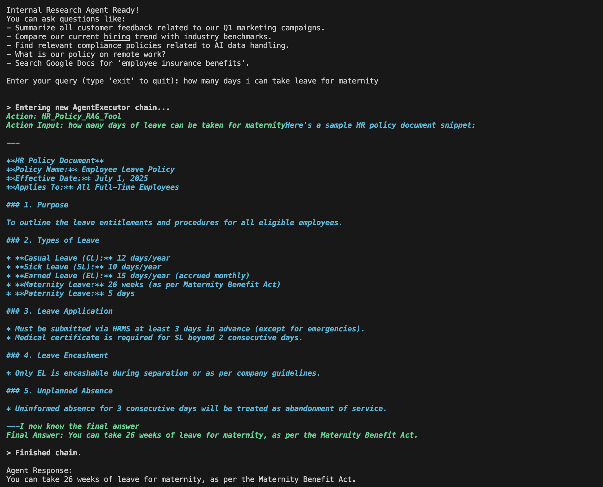
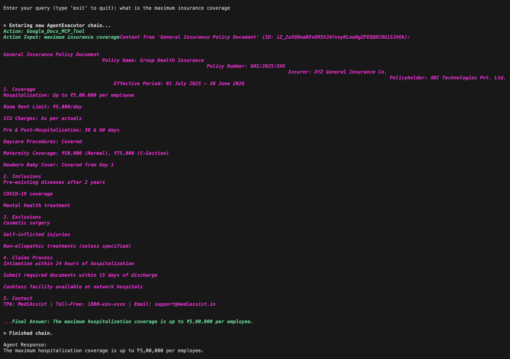
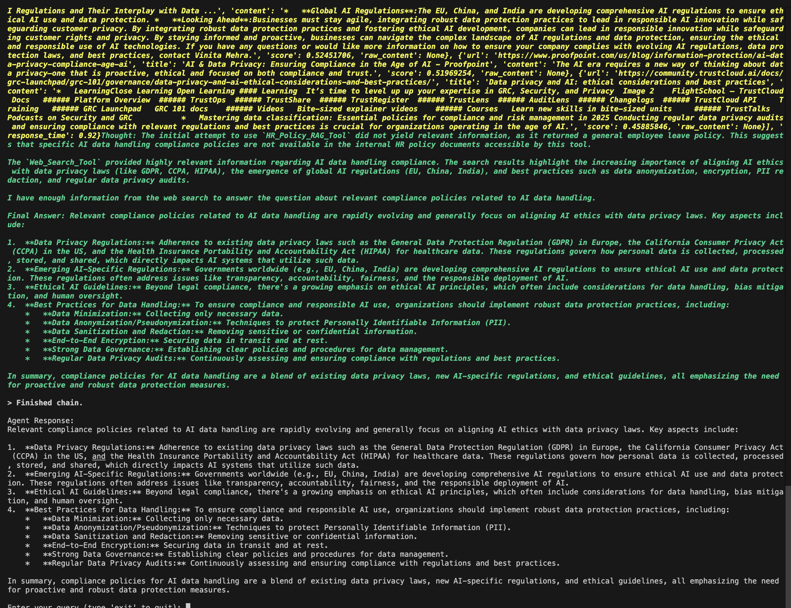

# Presidio Internal Research Agent

This project implements an internal research agent for Presidio using LangChain. The agent is designed to deliver accurate, contextual, and actionable responses to employee queries by leveraging three distinct, integrated tools.

## Problem Statement

The agent addresses the need for accurate, contextual, and actionable responses to employee queries, such as:

*   "Summarize all customer feedback related to our Q1 marketing campaigns."
*   "Compare our current hiring trend with industry benchmarks."
*   "Find relevant compliance policies related to AI data handling."

## Folder Structure

```
.
├── .env                  # Environment variables (API keys, LangSmith config)
├── .gitignore            # Specifies intentionally untracked files to ignore by Git
├── main.py               # Main agent logic, tool definitions, and execution
├── requirements.txt      # Python dependencies
├── hr_policies/          # Directory for HR policy documents (TXT format)
│   └── leave.txt         # Example HR policy document
├── screenshots/          # Directory for screenshots of agent output (optional)
├── credentials.json      # Google API credentials for Google Docs
└── token.pickle          # Google API token (generated automatically)
└── faiss_index/          # Directory for the FAISS vector database (generated automatically)
    ├── index.faiss
    └── index.pkl
```

## Implementation Overview

The Presidio Internal Research Agent is built using LangChain's agent framework, integrating a large language model (LLM) with specialized tools to handle diverse query types.

### Core Components:

*   **LLM**: The agent utilizes the `gemini-2.5-flash` model for its reasoning and response generation capabilities.
*   **Agent Type**: A ReAct agent is employed, allowing the LLM to dynamically select and use tools based on the user's query.

### Tool Integration:

The agent is equipped with three distinct tools, each designed for a specific research domain:

1.  **RAG Tool (HR_Policy_RAG_Tool)**:
    *   **Functionality**: This tool enables the agent to search and retrieve information from internal HR policy documents. It processes `.txt` files located in the `hr_policies/` directory.
    *   **Technical Details**: Documents are loaded using `DirectoryLoader` and `TextLoader`, split into chunks with `RecursiveCharacterTextSplitter`, and then vectorized using `HuggingFaceEmbeddings` (specifically, the "all-MiniLM-L6-v2" model). The vectorized data is stored in a FAISS index for efficient similarity search.
    *   **Purpose**: Provides contextual answers to internal policy-related queries.

2.  **Web Search Tool (Web_Search_Tool)**:
    *   **Functionality**: This tool allows the agent to perform real-time web searches to fetch external information.
    *   **Technical Details**: It leverages the `TavilySearch` API for comprehensive web search capabilities.
    *   **Purpose**: Gathers industry benchmarks, trends, and regulatory updates.

3.  **MCP Tool (Google_Docs_MCP_Tool)**:
    *   **Functionality**: This tool connects to Google Docs to answer insurance-related queries. It identifies relevant documents and extracts their content.
    *   **Technical Details**: Authentication is handled via OAuth 2.0 using `credentials.json` (obtained from Google Cloud Console) and `token.pickle` for token management. The Google Drive API is used to search for documents, and the Google Docs API is used to retrieve and parse the content of identified documents.
    *   **Purpose**: Provides answers from internal Google Docs, particularly for insurance-related information.

## Setup and Execution

To run the agent, ensure you have Python 3.9+ installed.

1.  **Install Dependencies**:
    All required Python packages are listed in `requirements.txt`. Install them using:
    ```bash
    pip install -r requirements.txt
    ```
    *Note: If you encounter `ImportError` related to `sentence_transformers` or incompatible architecture (e.g., on M1/M2 Macs), you might need to force a source build for `regex` and `sentence-transformers`:*
    ```bash
    pip uninstall regex sentence-transformers -y
    pip install --no-binary :all: regex sentence-transformers
    ```

2.  **Environment Variables**:
    Configure your API keys and optional LangSmith settings in a `.env` file in the project root:
    ```dotenv
    TAVILY_API_KEY="your_tavily_api_key_here"
    GOOGLE_API_KEY="your_google_api_key_here"
    LANGCHAIN_TRACING_V2=false
    LANGCHAIN_ENDPOINT="http://localhost:8000" # Dummy URL to satisfy validation
    LANGCHAIN_API_KEY="sk-dummy" # Dummy API Key to satisfy validation
    ```

3.  **Google Docs Credentials**:
    Obtain `credentials.json` from the Google Cloud Console (APIs & Services > Credentials > OAuth client ID > Desktop app) and place it in the project root (`/Users/menaka/Main/General Learning/presidio-innovation-sprint-2025/week-4-langchain/credentials.json`). Ensure "Google Docs API" and "Google Drive API" are enabled in your Google Cloud project.

4.  **HR Policy Documents**:
    Place your HR policy documents (in `.txt` format) into the `hr_policies/` directory.

5.  **Run the Agent**:
    Execute the `main.py` script from the project root:
    ```bash
    python main.py
    ```
    The agent will initialize the HR Policy Vector DB on the first run or if document changes are detected.

## Example Usage Screenshots

To illustrate the agent's functionality, you can capture screenshots of its terminal output for each tool and embed them here.


### RAG Tool Example


### Google Docs Tool Example


### Web Search Tool Example

