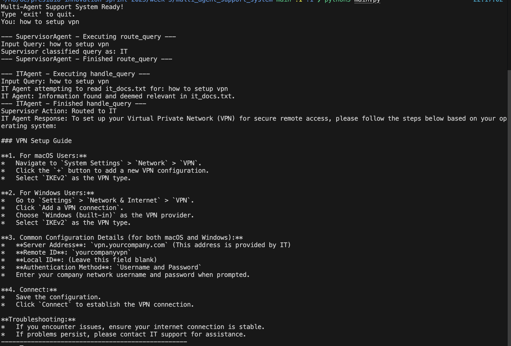
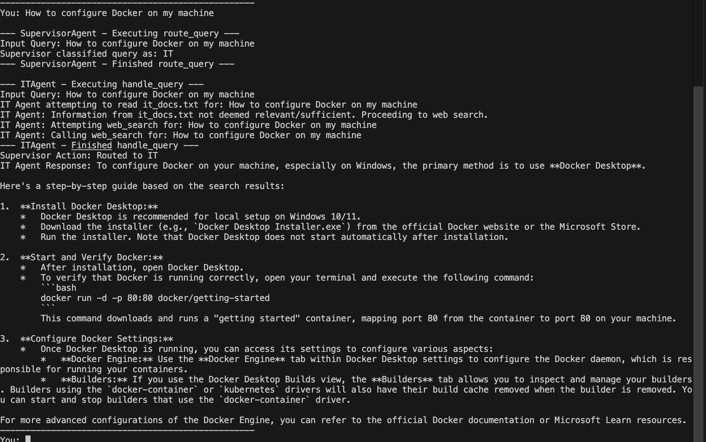
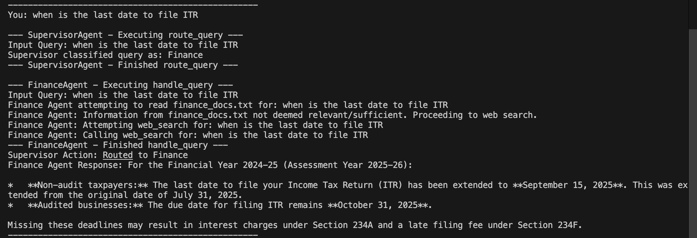
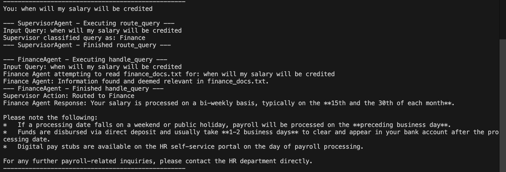

# Multi-Agent Support System with LangGraph

This project implements a multi-agent support system using LangGraph, designed to classify user queries and route them to specialized agents for resolution. The system features a Supervisor Agent, an IT Agent, and a Finance Agent, each equipped with specific tools and knowledge bases.

## Architecture

The system is built around a LangGraph workflow with the following agents:

1.  **Supervisor Agent**:
    *   **Purpose**: Classifies incoming user queries as either 'IT' or 'Finance'.
    *   **Action**: Routes the query to the appropriate specialist agent (IT Agent or Finance Agent).

2.  **IT Agent**:
    *   **Purpose**: Handles all IT-related queries.
    *   **Tools**:
        *   `ReadFile`: For accessing internal IT documentation (e.g., `it_docs.txt`).
        *   `WebSearch`: For searching external information sources if internal documentation is insufficient.
    *   **Example FAQs**: How to set up VPN? What software is approved for use? How to request a new laptop?

3.  **Finance Agent**:
    *   **Purpose**: Handles all Finance-related queries.
    *   **Tools**:
        *   `ReadFile`: For accessing internal finance documentation (e.g., `finance_docs.txt`).
        *   `WebSearch`: For searching public finance data if internal documentation is insufficient.
    *   **Example FAQs**: How to file a reimbursement? Where to find last month's budget report? When is payroll processed?

## Project Structure

```
week-5-multi-agent/
├── .env                      # Environment variables (API keys)
├── .gitignore                # Specifies intentionally untracked files to ignore
├── docs/                     # Directory for internal documentation files
│   ├── finance_docs.txt      # Internal finance documentation
│   └── it_docs.txt           # Internal IT documentation
├── main.py                   # Main application logic, LangGraph workflow, and agent definitions
├── README.md                 # Project README (this file)
├── requirements.txt          # Python dependencies
└── tools.py                  # Custom tools (read_file, web_search)
```

## Setup Instructions

Follow these steps to set up and run the multi-agent support system:

### 1. Clone the Repository (if applicable)

If you haven't already, clone the project repository:

```bash
git clone [repository_url]
cd multi_agent_support_system
```

### 2. Set up Environment Variables

Create a `.env` file in the `multi_agent_support_system/` directory (if it doesn't exist) and add your API keys for Google Generative AI and Tavily:

```dotenv
GOOGLE_API_KEY="your_google_api_key_here"
TAVILY_API_KEY="your_tavily_api_key_here"
```

Replace `"your_google_api_key_here"` and `"your_tavily_api_key_here"` with your actual API keys.

### 3. Install Dependencies

```bash
pip install -r requirements.txt
```

### 4. Populate Documentation Files (Optional)

You can add relevant content to `docs/it_docs.txt` and `docs/finance_docs.txt` to provide internal knowledge for the agents. Example content is already provided in the initial files.

## How to Run

Once the setup is complete, you can run the multi-agent support system:

```bash
python main.py
```

The system will start and prompt you to enter queries. Type `exit` to quit the application.
### Example Interaction

#### VPN Setup Query with internal docs


#### Docker Setup Query through websearch


#### ITR Related query through websearch 


#### Salary related qurey with internal docs
